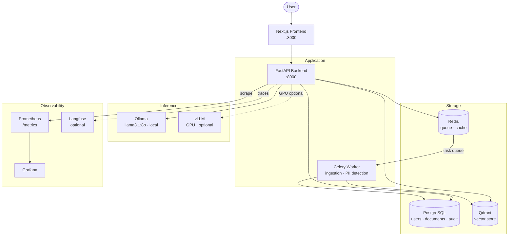

# AegisRAG

**Secure RAG Platform — Production-Oriented Prototype** — Phase 4

AegisRAG is a secure, tenant-isolated RAG (Retrieval-Augmented Generation) platform designed for regulated industries. It lets teams upload PDF documents, index them into a vector database, and ask natural-language questions — with answers grounded in the documents, returned with source citations, and secured by role-based access control.

---

## Architecture

AegisRAG is a multi-service system built for regulated environments. The backend enforces tenant isolation and classification-based access at every layer — from the API to the vector database. Document ingestion runs asynchronously via Celery; inference is pluggable (Ollama locally, vLLM on GPU for production); every operation produces an immutable audit record.



**Local dev**: `cd infra && docker compose up --build`  
**Production**: Kubernetes — API and worker scale independently via HPA. See [production deployment guide](docs/production-deployment.md).

---

## Core Design Principles

| Principle | Implementation |
|---|---|
| **Tenant isolation** | `tenant_id` enforced at every DB query and every Qdrant search — structural, not advisory |
| **Classification-aware retrieval** | Qdrant filters block out-of-classification chunks before any chunk reaches the model |
| **Local-first inference** | Restricted documents always use Ollama — never routed to external APIs |
| **Auditability** | Every login, query, upload, and role change writes an append-only audit event |
| **Prompt security** | Keyword, regex, and heuristic injection detection built into every query path |
| **Observability** | Prometheus metrics + 4 Grafana dashboards + optional Langfuse LLM tracing |
| **Evaluation-ready** | RAGAS offline evaluation script for measuring retrieval quality |

---

## Tech Stack

| Layer | Technology |
|---|---|
| API | FastAPI 0.111, Python 3.12, uvicorn |
| Package manager | uv |
| Database | PostgreSQL 16 + SQLAlchemy 2.0 + Alembic |
| Auth | JWT (python-jose) + Argon2 (argon2-cffi) |
| Rate limiting | slowapi (10 req/min on /auth/login) |
| Vector DB | Qdrant (dual-filter: tenant_id + classification) |
| Embeddings | sentence-transformers/all-MiniLM-L6-v2 (dim=384) |
| Retrieval | Hybrid: Qdrant vector + PostgreSQL FTS + RRF merge |
| Reranking | CrossEncoder/ms-marco-MiniLM-L-6-v2 (optional) |
| LLM — local | Ollama (llama3.1:8b; mandatory for restricted-class queries) |
| LLM — fast | vLLM via OpenAI-compatible API (optional, GPU) |
| Model routing | ModelRouter: restricted→local, complex→strong, default→fast |
| Streaming | SSE via FastAPI StreamingResponse + fetch ReadableStream |
| Caching | Redis — three tiers: embedding / retrieval / response |
| Observability | Prometheus (/metrics), Grafana (4 dashboards), Langfuse (optional), OTEL (optional) |
| Encryption | Fernet field-level encryption (optional, needs FIELD_ENCRYPTION_KEY) |
| Security alerts | Brute-force, prompt injection, abnormal volume, restricted access |
| Evaluation | RAGAS offline script (`evals/run_ragas_eval.py`; not an integrated API endpoint) |
| Load testing | Locust |
| Queue | Redis + Celery |
| Document formats | PDF (upload API); DOCX, Markdown, TXT supported by the parser but upload is PDF-only |
| PII detection | Regex (email, phone, SSN, credit card, IBAN) — hash+mask only |
| Frontend | Next.js 15 + TypeScript + TailwindCSS |
| Frontend state | Zustand + TanStack Query v5 |
| Frontend charts | Recharts |
| CI/CD | GitHub Actions (test, lint, docker-build, security-scan) |
| Container scan | Trivy (weekly) |
| Deployment | Kubernetes + Kustomize + Helm chart skeleton |
| Testing | pytest |
| Linting | ruff |

---

## Phase Summary

| Phase | Key Additions |
|---|---|
| **Phase 1** | Core RAG: upload → chunk → embed → Qdrant → Ollama → answer with sources. JWT auth, tenant isolation, Celery ingestion, audit log. |
| **Phase 2** | RBAC (4 roles), 4-level document classification, dual-filter Qdrant search, invitation flow, PII detection (hash+mask), compliance officer role. |
| **Phase 3** | Next.js frontend (8 pages), SSE streaming, persistent chat sessions with conversation memory, hybrid retrieval (vector + FTS + RRF), optional cross-encoder reranking, Langfuse observability, RAGAS offline evaluation script, prompt injection detection. |
| **Phase 4** | vLLM provider + model routing, Redis three-tier cache, Prometheus metrics + 4 Grafana dashboards, Fernet encryption, rate limiting, security alerts, usage metrics, compliance API (audit export, retention policy), monitoring API + dashboard page, K8s manifests (base + overlays + Helm), GitHub Actions CI/CD, Locust load tests, 6 production docs. |

---

## Security Model

### Roles and Classification Access

| Role | Public | Internal | Confidential | Restricted |
|---|---|---|---|---|
| `viewer` | ✓ | ✓ | — | — |
| `analyst` | ✓ | ✓ | ✓ | — |
| `compliance_officer` | ✓ | ✓ | ✓ | ✓ |
| `tenant_admin` | ✓ | ✓ | ✓ | ✓ |

### Key Security Properties

- **Retrieval isolation**: every Qdrant search enforces `tenant_id` AND `classification` filters at the DB layer — structural, not app-level
- **Restricted data**: never cached, never routed to vLLM — always goes to local Ollama
- **PII**: raw matched text is never stored; only SHA-256 hash + masked preview
- **Rate limiting**: `/auth/login` limited to 10 req/min per IP; brute-force alert after 5 failures in 15 min
- **Prompt injection**: keyword + regex detection blocks and logs attempts
- **Encryption**: optional Fernet field-level encryption (set `FIELD_ENCRYPTION_KEY`); Vault/KMS integration is not implemented — this is a recommended production hardening step, not a current feature

---

## Quick Start (Docker Compose)

```bash
# 1. Start all services
cd infra && docker compose up --build

# 2. Run migrations
docker exec -it infra-backend-1 uv run alembic upgrade head

# 3. Pull the LLM model
docker exec -it infra-ollama-1 ollama pull llama3.1:8b
```

- Backend API: http://localhost:8000
- Frontend: http://localhost:3000
- API docs: http://localhost:8000/docs
- Prometheus metrics: http://localhost:8000/metrics

### Optional: Langfuse observability
```bash
docker compose --profile langfuse up
# then set LANGFUSE_SECRET_KEY and LANGFUSE_PUBLIC_KEY in backend env
```

### Optional: vLLM (requires GPU, not included in docker-compose)
vLLM is supported via the provider abstraction and Kubernetes manifests (`infra/k8s/base/vllm.yaml`).
It is **not** a service in `docker-compose.yml`. To enable it, run vLLM separately and set:
```bash
VLLM_ENABLED=true
VLLM_BASE_URL=http://<your-vllm-host>:8080
VLLM_MODEL=mistralai/Mistral-7B-Instruct-v0.3
```

---

## Production Deployment (Kubernetes)

```bash
# Build and push images
docker build -t ghcr.io/your-org/aegisrag/backend:v0.4.0 ./backend
docker build -t ghcr.io/your-org/aegisrag/frontend:v0.4.0 ./frontend

# Deploy (production overlay)
kubectl apply -k infra/k8s/overlays/production

# Or with Helm
helm upgrade --install aegisrag infra/helm/aegisrag \
  --namespace aegisrag \
  --values infra/helm/aegisrag/values.yaml

# Run migrations
kubectl exec -n aegisrag deployment/aegisrag-api -- alembic upgrade head
```

See `docs/production-deployment.md` for the complete guide.

---

## Running Tests

```bash
cd backend
uv sync
uv run pytest
```

## Load Testing

```bash
cd backend
locust -f load_tests/locustfile.py --host http://localhost:8000
```

---

## API Highlights

```bash
BASE=http://localhost:8000/api/v1
TOKEN=<your-jwt>

# RAG query (non-streaming)
curl -X POST $BASE/rag/query \
  -H "Authorization: Bearer $TOKEN" \
  -d '{"question":"What is the retention policy?","top_k":5}'

# RAG streaming
curl -X POST $BASE/rag/query-stream \
  -H "Authorization: Bearer $TOKEN" \
  -d '{"question":"Explain the security model","top_k":5}'

# Audit export (CSV)
curl -X POST "$BASE/compliance/export-audit?format=csv" \
  -H "Authorization: Bearer $TOKEN" -o audit.csv

# Retention policy
curl -X PUT $BASE/compliance/retention-policy \
  -H "Authorization: Bearer $TOKEN" \
  -d '{"retention_days":90,"auto_delete_enabled":true}'

# System health (admin only)
curl $BASE/monitoring/health -H "Authorization: Bearer $TOKEN"

# Usage metrics
curl $BASE/monitoring/usage -H "Authorization: Bearer $TOKEN"
```

---

## Documentation

| Document | Description |
|---|---|
| [Architecture](docs/architecture.md) | Service inventory, ingestion pipeline, RAG query flow |
| [Security Model](docs/security-model.md) | RBAC, classification access, tenant isolation, PII handling |
| [Production Deployment](docs/production-deployment.md) | Kubernetes setup, scaling, upgrades |
| [Security Hardening](docs/security-hardening.md) | Production security recommendations |
| [Inference Architecture](docs/inference-architecture.md) | Model routing, provider abstraction |
| [Monitoring & Observability](docs/monitoring-observability.md) | Metrics, dashboards, alerting |
| [Scaling Strategy](docs/scaling-strategy.md) | Horizontal scaling, load testing |
| [Disaster Recovery](docs/disaster-recovery.md) | Backup, restore, RTO/RPO |

---

## Project Structure

```
AegisRAG/
  backend/
    app/
      api/routes/       auth, tenants, documents, rag, audit, users,
                        chat, evals, compliance, monitoring
      core/             config, enums, permissions, security, logging, limiter
      db/               SQLAlchemy engine + session
      models/           14 models (user, tenant, document, document_chunk,
                        audit_event, invitation, pii_finding, chat_session,
                        chat_message, evaluation_run, prompt_security_event,
                        security_alert, tenant_usage_metrics,
                        document_retention_policy)
      schemas/          Pydantic v2 request/response models
      services/         auth, tenant, document, document_parser, chunking,
                        embedding, qdrant, model_router, rag_service,
                        cache_service, encryption_service, metrics_service,
                        security_alert_service, usage_metrics_service,
                        audit, invitation, pii, chat, observability,
                        hybrid_retrieval, reranking, prompt_security,
                        inference/ (base_provider, ollama_provider, vllm_provider)
      workers/          Celery app + process_document task
    alembic/versions/   0001 – 0004
    evals/              run_ragas_eval.py + golden_questions/
    load_tests/         locustfile.py
  frontend/
    app/(dashboard)/    dashboard, documents, chat, audit, users, pii, evals, monitoring
    components/         UI + layout (Sidebar, Header)
    services/           rag, auth, documents, audit, users, evals
    stores/             authStore, chatStore
    hooks/              useAuth, useStream
  infra/
    docker-compose.yml
    k8s/base/           11 manifests (api, worker, frontend, postgres, redis,
                        qdrant, vllm, ingress, configmap, secrets, monitoring)
    k8s/overlays/       staging/, production/
    helm/aegisrag/      Chart.yaml, values.yaml, templates/
    monitoring/         prometheus.yml, alert_rules.yml,
                        grafana-dashboard-rag.json, -inference.json,
                        -workers.json, -security.json
  .github/workflows/    backend-tests, frontend-tests, docker-build, security-scan
  docs/
    production-deployment.md
    security-hardening.md
    inference-architecture.md
    monitoring-observability.md
    scaling-strategy.md
    disaster-recovery.md
    (+ earlier: architecture, security-model, threat-model, rag-pipeline,
      evaluation-framework, frontend-architecture)
```
