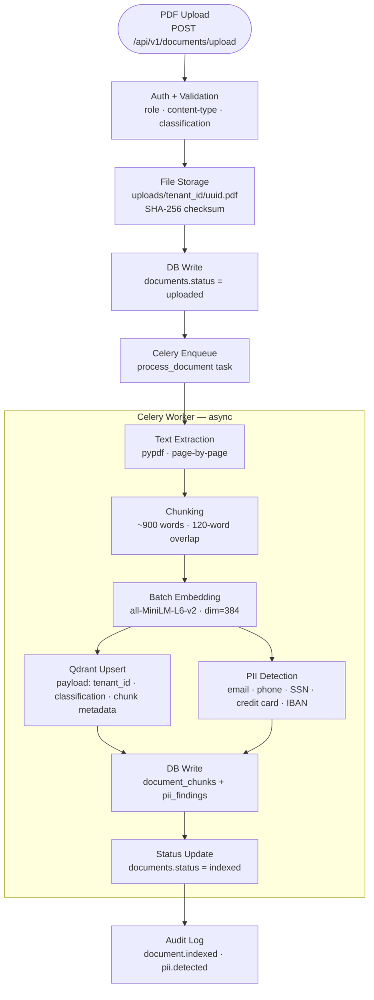
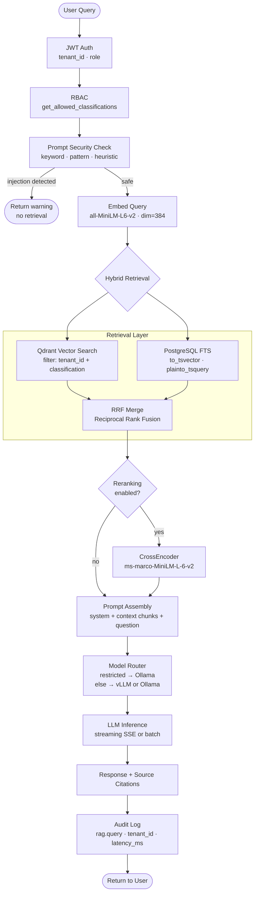

# AegisRAG Architecture

## Service Inventory

| Service | Technology | Purpose |
|---|---|---|
| **backend** | FastAPI (Python 3.12) | REST API, auth, RAG queries, compliance, monitoring |
| **backend-worker** | Celery | Async document ingestion, chunking, embedding, PII detection |
| **postgres** | PostgreSQL 16 | Users, tenants, documents, chunks, audit events, PII findings |
| **qdrant** | Qdrant | Vector store — dual-filtered by `tenant_id` and `classification` |
| **redis** | Redis 7 | Celery broker + three-tier cache (embedding · retrieval · response) |
| **ollama** | Ollama | Local LLM inference (mandatory for restricted-class queries) |
| **frontend** | Next.js 15 | React UI — dashboard, documents, chat, audit, monitoring pages |

---

## Document Ingestion Pipeline

Document processing is fully asynchronous. The upload endpoint validates and saves the file, writes a DB record, and immediately enqueues a Celery task — returning `202 Accepted` to the client. All heavy work happens in the worker.

**Why Celery?** PDF parsing and batch embedding can take 10–60 seconds per document. Async processing keeps upload latency low and allows the worker to scale independently of the API.

**Why does chunk metadata matter?** Every Qdrant point payload carries `tenant_id`, `classification`, `document_id`, `chunk_index`, and `page_number`. This makes retrieval filtering structural — the vector DB itself enforces access boundaries, not just the application layer.

**Why is classification embedded in vector payloads?** Because retrieval happens inside Qdrant. If classification were only checked after retrieval, a misconfigured query could leak restricted chunks. Embedding it in the payload makes the Qdrant filter the authoritative enforcement point.

---

## RAG Query Flow

Every query passes through authentication, RBAC, and prompt security checks before any retrieval occurs. Classification filtering happens inside Qdrant — not as a post-retrieval step.

**Why does filtering happen before retrieval?** `get_allowed_classifications` runs before the embedding step. The resulting list is passed directly into the Qdrant `must` filter. There is no code path where vectors are retrieved first and then filtered — that would risk leaking chunk text into intermediate state.

**Why does reranking improve quality?** Vector similarity and keyword search optimise for different signals. The CrossEncoder re-scores the merged candidate set with a model trained specifically for passage relevance, producing a tighter top-k before the prompt is assembled.

**Why are citations mandatory?** The system prompt instructs the LLM to answer only from the provided context. Source citations (document name, page number, chunk index) are extracted from the retrieval results — not generated by the model — so they reference real document locations.

---

## Tenant Isolation

Isolation is enforced at three independent layers. Bypassing one layer is not sufficient to cross a tenant boundary.

1. **Authentication** — JWT tokens carry `tenant_id`. The `get_tenant_user` FastAPI dependency rejects requests from users with no tenant or an inactive account.

2. **Database** — Every query on `documents`, `document_chunks`, `pii_findings`, and `audit_events` includes `WHERE tenant_id = ?`. SQLAlchemy model methods do not accept queries without this filter.

3. **Vector database** — Every call to `qdrant_service.search()` includes a `must` filter on `payload.tenant_id`. There is no code path that bypasses this filter.

---

## Component Responsibilities

### FastAPI Backend
Authentication, tenant management, document upload, RAG queries, compliance exports, monitoring endpoints, security alerts. Uses synchronous SQLAlchemy sessions (psycopg2) — simple and Celery-compatible.

### PostgreSQL
Stores all structured data. Key tables:
- `tenants` — tenant registry
- `users` — accounts with role and tenant FK
- `documents` — file metadata, status, classification
- `document_chunks` — chunked text with Qdrant point IDs and token counts
- `audit_events` — immutable append-only event log (JSONB metadata)
- `pii_findings` — hashed PII matches with masked previews only
- `security_alerts` — brute-force, injection, and restricted-access events
- `tenant_usage_metrics` — per-tenant query counts, token usage, latency

### Qdrant
Stores 384-dimensional embedding vectors (all-MiniLM-L6-v2). Every point carries a payload with `tenant_id`, `classification`, `document_id`, `chunk_id`, `chunk_index`, `page_number`, `text`, and `original_filename`. Dual-filter on `tenant_id` + `classification` is applied on every search.

### Redis + Celery
Redis is the Celery broker and also the three-tier cache (embedding cache, retrieval cache, response cache). Restricted-classification queries are never cached. The `backend-worker` container runs the Celery worker process.

### Ollama
Hosts the local LLM (default: `llama3.1:8b`). Called via HTTP. The system prompt instructs the model to answer only from the provided context chunks. All restricted-classification queries are routed here — never to vLLM.

### Model Router
`ModelRouter.build_request()` selects the inference provider based on the document classification and query complexity:
- `restricted` classification → always Ollama
- `complex` query (token count above threshold) → strong model (vLLM if enabled, else Ollama)
- default → fast model (vLLM if enabled, else Ollama)
