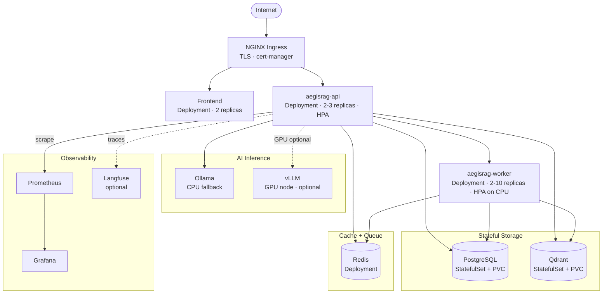

# Production Deployment Guide

## Kubernetes Deployment Architecture

In production, the API and worker deployments scale independently. The API handles synchronous request traffic; workers handle CPU-bound ingestion tasks. Stateful services (PostgreSQL, Qdrant) use StatefulSets with persistent volumes.



**Why are workers separated from API pods?** Document ingestion is CPU-bound (embedding generation) and can run for 10–60 seconds per document. Mixing ingestion work into API pods would cause request timeouts and unpredictable latency. Separate worker pods also allow independent HPA scaling based on CPU load.

**Why is vLLM isolated?** vLLM requires a GPU node. Isolating it as a separate Deployment with a `nodeSelector` prevents it from consuming GPU resources on CPU nodes and allows independent restarts without affecting the API.

---

## Prerequisites

- Kubernetes cluster (1.28+) with NVIDIA GPU node pool (for vLLM)
- `kubectl`, `helm`, `kustomize` installed
- Container registry access (GitHub Container Registry or similar)
- Domain name with DNS control
- cert-manager installed in the cluster

## Quick Start

### 1. Build and push images

```bash
# Backend
docker build -t ghcr.io/your-org/aegisrag/backend:v0.4.0 ./backend
docker push ghcr.io/your-org/aegisrag/backend:v0.4.0

# Frontend
docker build -t ghcr.io/your-org/aegisrag/frontend:v0.4.0 ./frontend
docker push ghcr.io/your-org/aegisrag/frontend:v0.4.0
```

### 2. Create namespace and secrets

```bash
kubectl create namespace aegisrag

kubectl create secret generic aegisrag-secrets \
  --namespace aegisrag \
  --from-literal=POSTGRES_USER=aegisrag \
  --from-literal=POSTGRES_PASSWORD="$(openssl rand -base64 32)" \
  --from-literal=POSTGRES_DB=aegisrag \
  --from-literal=SECRET_KEY="$(openssl rand -base64 48)" \
  --from-literal=FIELD_ENCRYPTION_KEY="$(python -c 'from cryptography.fernet import Fernet; print(Fernet.generate_key().decode())')"
```

### 3. Apply manifests

```bash
# Using kustomize (production overlay)
kubectl apply -k infra/k8s/overlays/production

# Or using Helm
helm upgrade --install aegisrag infra/helm/aegisrag \
  --namespace aegisrag \
  --values infra/helm/aegisrag/values.yaml \
  --set image.backend.tag=v0.4.0 \
  --set image.frontend.tag=v0.4.0
```

### 4. Run database migrations

```bash
kubectl exec -n aegisrag deployment/aegisrag-api -- \
  alembic upgrade head
```

### 5. Verify deployment

```bash
kubectl get pods -n aegisrag
kubectl logs -n aegisrag deployment/aegisrag-api --follow
curl https://aegisrag.example.com/api/v1/health
```

## Environment Variables

All required environment variables are documented in `infra/k8s/base/configmap.yaml` and `infra/k8s/base/secrets.yaml`.

Critical secrets that must be set before deployment:
- `POSTGRES_PASSWORD` — PostgreSQL password
- `SECRET_KEY` — JWT signing key (minimum 32 characters)
- `FIELD_ENCRYPTION_KEY` — Fernet key for field-level encryption (optional but recommended)

## Scaling

The API and worker deployments have HPA configured. To manually scale:

```bash
kubectl scale deployment aegisrag-api --replicas=5 -n aegisrag
kubectl scale deployment aegisrag-worker --replicas=8 -n aegisrag
```

## Upgrades

```bash
# Update image tags
kubectl set image deployment/aegisrag-api api=ghcr.io/your-org/aegisrag/backend:v0.4.1 -n aegisrag

# Run migrations after upgrade
kubectl exec -n aegisrag deployment/aegisrag-api -- alembic upgrade head
```

## Rollback

```bash
kubectl rollout undo deployment/aegisrag-api -n aegisrag
```
