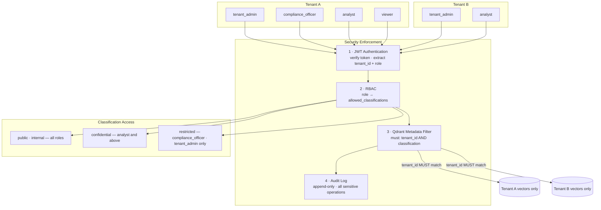

# AegisRAG Security Model

## RBAC Model

AegisRAG uses role-based access control scoped to a tenant. Every user has exactly one role within their tenant.

### Roles

| Role | Description |
|---|---|
| `tenant_admin` | Full control. First user to create a tenant becomes admin. |
| `compliance_officer` | Security oversight. Can view everything, cannot manage users. |
| `analyst` | Day-to-day user. Upload, query internal/confidential documents. |
| `viewer` | Read-only access to public and internal documents only. |

### Permission Matrix

| Action | tenant_admin | compliance_officer | analyst | viewer |
|---|---|---|---|---|
| Upload documents | ✅ | ✅ | ✅ | ❌ |
| Delete documents | ✅ | ❌ | ❌ | ❌ |
| Update document classification | ✅ | ✅ | ❌ | ❌ |
| Reindex documents | ✅ | ✅ | ❌ | ❌ |
| View PII findings | ✅ | ✅ | ❌ | ❌ |
| Invite users | ✅ | ❌ | ❌ | ❌ |
| Update user roles | ✅ | ❌ | ❌ | ❌ |
| Deactivate users | ✅ | ❌ | ❌ | ❌ |
| List users | ✅ | ✅ | ❌ | ❌ |
| View audit logs | ✅ | ✅ | ❌ | ❌ |
| Query RAG | ✅ | ✅ | ✅ | ✅ |

---

## Document Classification

Every document has a classification level assigned at upload time (default: `internal`).

| Level | Description |
|---|---|
| `public` | Unrestricted. Accessible by all roles. |
| `internal` | Standard company documents. Not for public release. |
| `confidential` | Sensitive business content. Analysts and above. |
| `restricted` | Highest sensitivity. Accessible only to `compliance_officer` and `tenant_admin`. Never cached, never routed to vLLM. |

### Classification Access Matrix

| Classification | tenant_admin | compliance_officer | analyst | viewer |
|---|---|---|---|---|
| public | ✅ | ✅ | ✅ | ✅ |
| internal | ✅ | ✅ | ✅ | ✅ |
| confidential | ✅ | ✅ | ✅ | ❌ |
| restricted | ✅ | ✅ | ❌ | ❌ |

---

## Retrieval Filtering

Classification filtering is applied at the Qdrant query level — it is not advisory.

Every call to `qdrant_service.search()` enforces **two mandatory filters**:

1. `tenant_id` — cross-tenant leakage is structurally impossible
2. `classification` in `allowed_classifications` — derived from the user's role

This means even if the application layer were compromised, the vector database would not return documents outside the user's permitted classification set.

The Qdrant point payload for each chunk includes:
- `tenant_id`
- `document_id`
- `classification`
- `uploaded_by_id`
- `chunk_id`, `chunk_index`, `page_number`, `text`, `original_filename`

**Important**: Documents indexed before Phase 2 (without `classification` in their payload) will not be returned by searches. Reindex them via `POST /api/v1/documents/{id}/reindex`.

---

## Audit Logging

All security-relevant events are written to the `audit_events` table. Audit records are append-only and include request context where available.

### Logged Event Types

| Event | Trigger |
|---|---|
| `auth.login_success` | Successful authentication |
| `auth.login_failed` | Failed login attempt |
| `tenant.created` | New tenant created |
| `user.invited` | Invitation issued |
| `user.invite_accepted` | Invitation accepted |
| `user.role_updated` | Role change by admin |
| `user.deactivated` | User deactivated by admin |
| `document.uploaded` | PDF accepted and queued |
| `document.indexed` | Processing complete |
| `document.index_failed` | Processing failed |
| `document.deleted` | Document removed by admin |
| `document.classification_updated` | Classification changed |
| `document.reindex_requested` | Reindex enqueued |
| `rag.query` | RAG query executed (includes allowed_classifications) |
| `pii.detected` | PII found during ingestion |

Fields available on every event: `tenant_id`, `user_id`, `event_type`, `entity_type`, `entity_id`, `metadata_json`, `ip_address`, `user_agent`, `created_at`.

---

## PII Handling

PII is detected during document ingestion using regex patterns for:
- Email addresses
- Phone numbers (US format)
- US Social Security Numbers (SSN)
- Credit card numbers (16-digit)
- IBANs

**Storage rules:**
- Raw matched text is **never stored**
- The SHA-256 hash of the raw match is stored (`matched_text_hash`)
- A masked preview is stored (`matched_text_preview`):
  - Email: `jo***@example.com`
  - Phone: `****5309`
  - SSN: `***-**-6789`
  - Credit card: `**** **** **** 1234`
  - IBAN: `GB29****6819`

PII findings are accessible only to `tenant_admin` and `compliance_officer` via `GET /api/v1/documents/{id}/pii-findings`.

---

## Tenant Isolation and Security Layers

Every request passes through four sequential enforcement layers. Bypassing any single layer is insufficient to cross a tenant boundary or access out-of-classification documents.

Tenant isolation is enforced at three independent layers:

1. **Authentication**: JWT tokens identify users; users without `tenant_id` cannot access tenant-scoped endpoints.
2. **Database**: Every query on `documents`, `document_chunks`, `pii_findings`, and `audit_events` includes a `WHERE tenant_id = ?` filter.
3. **Vector database**: Every Qdrant search includes a `must` filter on `payload.tenant_id`. No search path bypasses this filter.

**Important**: Backend authorization is authoritative. Frontend visibility restrictions (hiding menu items, disabling buttons) are a UX convenience only — they are not trusted security controls. All access decisions are made server-side.

---

## Known Limitations (Phase 2)

- No encryption-at-rest for stored PDF files
- No SSO / SAML / OIDC integration
- Invite tokens are returned in the API response (no email delivery)
- Restricted documents are accessible only to `tenant_admin` and `compliance_officer` roles; analysts cannot access restricted documents regardless of ownership
- No IP allowlisting or rate limiting
- No production secrets manager (environment variable–based config only)
- PII detection is regex-based; it does not use ML models and may miss context-dependent PII
